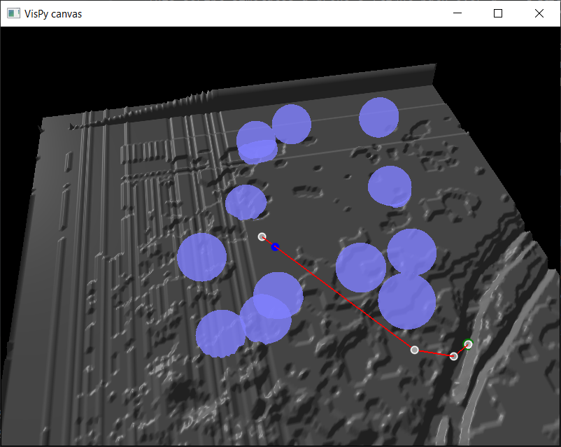

# Drone Flight Path Simulation

This script simulates a drone's flight path over a terrain, taking into account various factors like altitude, obstacles, and path optimization using the RRT* (Rapidly-exploring Random Tree) algorithm.

## Functionality

The script consists of several key functions:

- `sample_point`: Generates a random 3D point within specified altitude limits, based on the terrain's height map.
- `update`: Simulates the drone's movement, updates the pathfinding algorithm, and handles the drone's interactions with obstacles and boundaries.
- `generate_rrt_star`: Creates an RRT* tree for pathfinding in 3D space, considering the terrain and moving obstacles.
- `find_path`: Finds the shortest path from the start to the target within the RRT* tree by tracing back through parent nodes.

## Height Map and Obstacles Handling

The script uses a TIFF file as a height map for the terrain. The height map provides the altitude data for each point in the terrain, which is used to determine the drone's altitude limits and the placement of obstacles.

Obstacles are randomly placed within the map, with their positions and altitudes determined based on the height map and the specified obstacle parameters. Each obstacle has a visual radius and a safety radius. The visual radius is the actual size of the obstacle, while the safety radius is a buffer zone around the obstacle that the drone must also avoid. The drone's pathfinding algorithm takes into account these obstacles and their safety radii when determining the optimal path.

## Adjustable Parameters

The script allows for several parameters to be adjusted:

- `MAP_FILE`: The map file is a TIFF file that contains the height map for the terrain over which the drone will be flying.
- `X_MIN`, `X_MAX`, `Y_MIN`, `Y_MAX`: The X and Y coordinates of the map.
- `MAP_HEIGHT_MARGIN`: Used to add some buffer to the terrain height.
- `SEED`: The seed for the random number generator.
- `MAX_ALTITUDE`: The maximum altitude for the drone.
- `NUM_NODES`: The number of nodes for the RRT* algorithm to generate for pathfinding.
- `NUMBER_OF_OBSTACLES`, `OBSTACLES_VISUAL_RADIUS`, `OBSTACLES_SAFETY_RADIUS`, `OBSTACLES_MIN_ALTITUDE`, `OBSTACLES_PENALTY_FACTOR`, `OBSTACLES_SPEED_FACTOR`: Parameters related to the obstacles in the map.
- `DRONE_START`, `DRONE_TARGET`, `DRONE_SPEED_FACTOR`, `DRONE_STEERING_NOISE_SIGMA`, `TARGET_TOLERANCE`: Parameters related to the drone's start and target positions, speed, steering noise, and target tolerance.
- `TIME_PERIOD`: The time period between path updates

## 3D Visualization
The script uses the `vispy` package to create a 3D visualization of the drone's flight path, the terrain, and the obstacles. The visualization shows the drone's current position, the target position, and the optimal path as determined by the RRT* algorithm. The terrain is rendered based on the height map, and the obstacles are shown as spheres with radii equal to their visual radii.

## Algorithmic Background

The script uses the RRT* algorithm for pathfinding. RRT* is a graph-based planning algorithm designed to efficiently search nonconvex, high-dimensional spaces by randomly building a space-filling tree. The tree is constructed incrementally from samples drawn randomly from the search space and is inherently biased to grow towards large unsearched areas of the problem. RRT* algorithm, unlike RRT, reduces the path cost by gradually refining the tree branches as more nodes are added.

Please refer to the original paper on RRT* for more details: S. Karaman and E. Frazzoli, "Sampling-based algorithms for optimal motion planning," in International Journal of Robotics Research, vol. 30, no. 7, pp. 846-894, June 2011.

